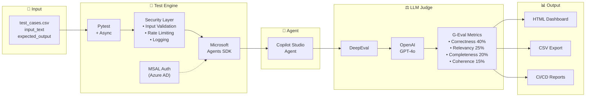

# Copilot Studio Automated Testing Architecture

## Do not use - 

### Option 1: Simple Flow (What you have - Enhanced)

```
┌─────────────────────────────────────────────────────────────────────────────────────────────────┐
│                     COPILOT STUDIO AUTOMATED TESTING WITH DEEPEVAL G-EVALS                      │
└─────────────────────────────────────────────────────────────────────────────────────────────────┘

    ┌──────────┐      ┌──────────────────┐      ┌─────────────────┐      ┌──────────────────┐
    │   CSV    │      │   Test Engine    │      │  Copilot Studio │      │   LLM Judge      │
    │  -----   │─────▶│   -----------    │─────▶│     Agent       │─────▶│   ---------      │
    │input_text│      │    Pytest +      │      │                 │      │  DeepEval +      │
    │expected  │      │Microsoft Agents  │      │   Your Agent    │      │  OpenAI GPT-4o   │
    │_output   │      │     SDK          │      │                 │      │                  │
    └──────────┘      └──────────────────┘      └─────────────────┘      └──────────────────┘
                              │                                                   │
                              │                                                   │
                      ┌───────▼───────┐                                 ┌─────────▼─────────┐
                      │     MSAL      │                                 │   G-Eval Metrics  │
                      │ Authentication│                                 │   ─────────────   │
                      │  (Azure AD)   │                                 │ • Correctness 40% │
                      └───────────────┘                                 │ • Relevancy   25% │
                                                                        │ • Completeness20% │
                                                                        │ • Coherence   15% │
                                                                        └───────────────────┘
                                                                                  │
                                                                                  ▼
                                                                        ┌───────────────────┐
                                                                        │  HTML Dashboard   │
                                                                        │  + CSV Export     │
                                                                        └───────────────────┘
```

### Option 2: Complete Enterprise Architecture

```
┌─────────────────────────────────────────────────────────────────────────────────────────────────────┐
│              ENTERPRISE COPILOT STUDIO TESTING AUTOMATION FRAMEWORK                                  │
│                           Pytest + DeepEval G-Evals + Microsoft Agents SDK                          │
└─────────────────────────────────────────────────────────────────────────────────────────────────────┘

┌─────────────┐     ┌─────────────────────────────────────────────────────────────────────────────────┐
│             │     │                              TEST EXECUTION LAYER                                │
│   INPUT     │     │  ┌─────────────┐    ┌──────────────┐    ┌─────────────┐    ┌───────────────┐   │
│   ─────     │     │  │   Pytest    │    │   Security   │    │  Microsoft  │    │    Copilot    │   │
│             │────▶│  │   Engine    │───▶│    Layer     │───▶│   Agents    │───▶│    Studio     │   │
│  test_cases │     │  │             │    │              │    │     SDK     │    │    Agent      │   │
│    .csv     │     │  │ Async Tests │    │• Input Valid.│    │             │    │               │   │
│             │     │  │ Parametrized│    │• Rate Limit  │    │ DirectLine  │    │  Your Bot     │   │
│ • input_text│     │  │             │    │• Logging     │    │  Protocol   │    │               │   │
│ • expected  │     │  └─────────────┘    └──────────────┘    └─────────────┘    └───────────────┘   │
│   _output   │     │                                                                                  │
└─────────────┘     └─────────────────────────────────────────────────────────────────────────────────┘
                                                      │
                           ┌──────────────────────────┼──────────────────────────┐
                           │                          │                          │
                           ▼                          ▼                          ▼
                    ┌─────────────┐           ┌─────────────┐           ┌─────────────┐
                    │    MSAL     │           │   Actual    │           │  Structured │
                    │    Auth     │           │   Response  │           │   Logging   │
                    │  ─────────  │           │  ─────────  │           │  ─────────  │
                    │ • Azure AD  │           │ Agent text  │           │ • JSON logs │
                    │ • Interactive│          │  response   │           │ • Corr. IDs │
                    │ • Service   │           │             │           │ • SIEM ready│
                    │   Principal │           │             │           │             │
                    └─────────────┘           └──────┬──────┘           └─────────────┘
                                                     │
                                                     ▼
┌─────────────────────────────────────────────────────────────────────────────────────────────────────┐
│                                    EVALUATION LAYER (LLM-as-a-Judge)                                 │
│                                                                                                      │
│    ┌───────────────────────────────────────────────────────────────────────────────────────────┐    │
│    │                              DeepEval G-Eval Metrics                                       │    │
│    │                                                                                            │    │
│    │   ┌─────────────────┐  ┌─────────────────┐  ┌─────────────────┐  ┌─────────────────┐     │    │
│    │   │  CORRECTNESS    │  │    RELEVANCY    │  │   COHERENCE     │  │  COMPLETENESS   │     │    │
│    │   │    (40%)        │  │     (25%)       │  │     (15%)       │  │     (20%)       │     │    │
│    │   │  ───────────    │  │  ───────────    │  │  ───────────    │  │  ───────────    │     │    │
│    │   │ Factual         │  │ Addresses the   │  │ Logical flow    │  │ Covers all      │     │    │
│    │   │ accuracy vs     │  │ user's actual   │  │ and clarity     │  │ key points      │     │    │
│    │   │ expected output │  │ question        │  │ of response     │  │ from expected   │     │    │
│    │   └─────────────────┘  └─────────────────┘  └─────────────────┘  └─────────────────┘     │    │
│    │                                                                                            │    │
│    │                         Powered by: OpenAI GPT-4o (configurable)                          │    │
│    └───────────────────────────────────────────────────────────────────────────────────────────┘    │
│                                                                                                      │
└─────────────────────────────────────────────────────────────────────────────────────────────────────┘
                                                     │
                                                     ▼
┌─────────────────────────────────────────────────────────────────────────────────────────────────────┐
│                                         OUTPUT LAYER                                                 │
│                                                                                                      │
│   ┌────────────────────┐    ┌────────────────────┐    ┌────────────────────┐                        │
│   │   HTML Dashboard   │    │    CSV Export      │    │    CI/CD Reports   │                        │
│   │   ──────────────   │    │    ──────────      │    │    ────────────    │                        │
│   │ • Pass/Fail stats  │    │ • All metrics      │    │ • GitHub Actions   │                        │
│   │ • Score breakdown  │    │ • Reasons          │    │ • Azure DevOps     │                        │
│   │ • Detailed reasons │    │ • Conversation IDs │    │ • JUnit XML        │                        │
│   │ • Search/Filter    │    │ • Full responses   │    │ • Trend tracking   │                        │
│   └────────────────────┘    └────────────────────┘    └────────────────────┘                        │
│                                                                                                      │
└─────────────────────────────────────────────────────────────────────────────────────────────────────┘
```

### Option 3: Mermaid Diagram



## Key Facts

### Technology Stack
| Component | Technology |
|-----------|------------|
| Test Framework | **Pytest** (async, parametrized) |
| Agent SDK | **Microsoft Agents SDK** (DirectLine) |
| Authentication | **MSAL** (Azure AD, supports Service Principal) |
| Evaluation Framework | **DeepEval** with G-Eval metrics |
| LLM Judge | **OpenAI GPT-4o** (configurable to Azure OpenAI) |
| Security | Input validation, Rate limiting, Structured logging |
| CI/CD | GitHub Actions / Azure DevOps ready |

### Evaluation Metrics (Weighted)
| Metric | Weight | Purpose |
|--------|--------|---------|
| **Correctness** | 40% | Factual accuracy vs expected output |
| **Relevancy** | 25% | Addresses the user's actual question |
| **Completeness** | 20% | Covers all key points |
| **Coherence** | 15% | Logical flow and clarity |

### Key Benefits
1. ✅ **Automated Quality Assurance** - No manual testing required
2. ✅ **LLM-as-a-Judge** - Semantic evaluation, not just string matching
3. ✅ **Enterprise Security** - Prompt injection protection, rate limiting
4. ✅ **CI/CD Integration** - Automated regression testing on every deployment
5. ✅ **Detailed Reporting** - HTML dashboard + CSV export for analysis
6. ✅ **Scalable** - Runs 50+ test cases in minutes


```
